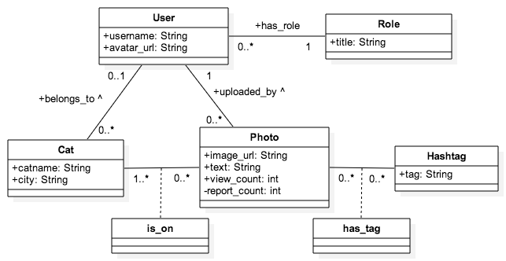

# catstagram
Simple Cat version of Instragram in Ruby on Rails - for Webrails class at HEIG-VD

## Provisional Report

### Context and Authors
This is a Ruby on Rails project for WebRails class at HEIG-VD, Yverdon-les-Bains, Switzerland.

Authors:

 - [Eleonore d'Agostino](http://github.com/paranoodle)
 - [Valentin Minder](http://github.com/ValentinMinder)

### General Description

Catstragram is a simple version of Instragram for picture of cats only. It allows registered users to upload picture of cats, tag them and share them with all their friends, because sharing is caring ;3 

The more you share, the more views you get! :D

Guest can see cat's pictures and user's pictures! And cats by categories, of course!

Be cautious, if you upload anything else than a cat picture and you get reported too many times, the admin might ban you!

### Usecases

See the following image:



### Database schema

See the following image:



### Iterations plan

#### Week 8-9 (18.04. - 01.05.2016)

- basic structure of whole project (scaffold, db, basic usable layout, ...)
- no permissions: CRUD on everything

#### Week 10-11 (02.05. - 15.05.2016)

- authentification (with Devise)
- permissions (guest, user, admin) (with CanCanCan)
- basic upload form

#### Week 12-13-14 (16.05. - 05.06.2016)

- AJAX: autocompletion of hashtags
- AJAX: other ?!
- pretty upload form
- clean and pretty layout (UI)
- report and presentations preparations

#### Week 15-16 (06.06 - 19.06.2016)

Oral presentations