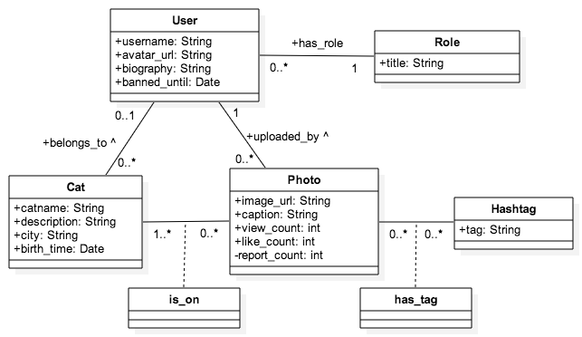

# catstagram
Simple Cat version of Instragram in Ruby on Rails - for Webrails class at HEIG-VD

## Provisional Report

### Context and Authors
This is a Ruby on Rails project for WebRails class at HEIG-VD, Yverdon-les-Bains, Switzerland.

Authors:

 - [Eleonore d'Agostino](http://github.com/paranoodle)
 - [Valentin Minder](http://github.com/ValentinMinder)

### General Description

Catstragram is a simple version of Instagram for photos of cats only. It allows registered users to upload photos of cats, tag them and share them with all their friends, because sharing is caring ;3 

The more you share, the more views you get! :D

Guests can see cats' photos and users' photos! And cats by categories, of course!

Be cautious, if you upload anything else than a cat photo and you get reported too many times, the admins might ban you!

### Usecases

See the following image:

A guest is a non-registered or non-logged visitor of the website. It is limited to VIEW capacities on everything, but has no right to EDIT. A guest may:

- view user and cats profile details
- search and view photos by hashtag, user or cat
- view photos (direct link to single photo) - the view count of the photo is increased
- create account with sign-up / login with sign-in

A user is a registered and logged visitor of the website that doesn't have admin rights. A user has VIEW capabilites on everything, and EDIT capabilites on its own data. A user may:

- do everything a guest can
- edit own user profile
- upload or edit photo on his own account. Uploading a photo includes optionnally tagging cats and categories (hashtags). This includes create new hashtags (categories), when those available are not enough. Of course it can upload photos of cats that doesn't belong to him.
- create or update cat profiles (of his own cats only)
- report bad photos, like those with dogs - the report count of the photo is increased
- like photos - the like count of the photo is increased

An admin is a registered and logged visitor of the website that does have admin rights. An admin has right to VIEW and EDIT on everything. An admin may:

- do everything a User can
- view the report count of a photo, recieve some kind of alerts of new reports, and reset reports count
- decide what to do with reported photo, including banning users, when they were reported for bad behaviors
- edit everything (CRUD actions), including remove the reported photo and the associated user, or edit any field/relation that doesn't have a special meaning.

Note that views, likes and reports counts are not related to users. View counts reflects the number of times a photo was open in a browser, even if it was done 10x by the same guy. The same goes with like and reports, but those are only available for logged users. This system is open to abuse but it keeps the whole thing simple, otherwise it would require a lot more relations and a more complex system. 

### Database schema

See the following image:

A user is a registered human visitor that may have some role (and admin rights). Fields generated by Devise for account creation and authentication are not shown. Users own cats and upload photos (therefore cats belongs to their user owner, and photos are uploaded by user).

Cats are tagged on photos, and at least one cat must be tagged on the photo. If the cat is unknown, a special entity called the "Chanonyme" (Catnonymous) is tagged.

Hashtags are kind of categories, where any photo may belong to any number of hashtags (from 0 to N).

### About permissions and rights

The following times fields are set once and forever, and cannot be edited, even by an admin:

- creation_time
- upload_time

All the counts fields cannot be edited, even by an admin, they are set to 0 by default and incremented automatically when the related action are performed. However, admin may reset the report count to 0 when handling reports. 

Admin may set the banned_until field to ban a user (otherwise this field is left blank). Users cannot connect until the end of the ban period.

In all entities, their is at least one field that is mandatory. All the others are optional (or they have special meaning, explained before)

- username
- title
- catname
- image_url
- tag

Users may add/edit/remove all **other** data:

- in their profile (username, avatar_url, biography)
- in their cats' profile (catname, city, description, birth_time)
- in the photo they uploaded (caption, cats tagged, hashtags tagged). The url cannot be changed though. If a user wish to change photo, it has to delete this one and upload a new one, as likes/hashtags/cats tagged may not be relevant to the new photo.

Users may remove a photo, a profile of a cat they own, or even their whole profile (deleting all data from their photos and cats).

As the admin has CRUD rights on everything, it can do everything a user can on all users' data. Moreover, it has special CRUD rights (in that sense, edit means all CRUD actions)

- The admin sets the `banned_until` field and resets the `report_count` field
- A cat that is not owned is only editable by the admin
- The admin may asign cats to an owner, or remove ownership
- The admin assignes roles
- The admin edits hashtags

### Iterations plan

#### Week 8-9 (18.04. - 01.05.2016)

- basic structure of whole project (scaffold, db, basic usable layout...)
- no permissions: basic CRUD operations on everything

#### Week 10-11 (02.05. - 15.05.2016)

- account creation and authentification (with Devise)
- permissions (guest, user, admin) (with CanCanCan)
- basic upload form, with tagging cats and hashtags

#### Week 12-13-14 (16.05. - 05.06.2016)

- AJAX: autocompletion of hashtags in upload form
- AJAX: update of views/likes count asynchronous
- pretty upload form
- clean and pretty layout (UI)
- report and presentations preparations

#### Week 15-16 (06.06 - 19.06.2016)

Oral presentations
