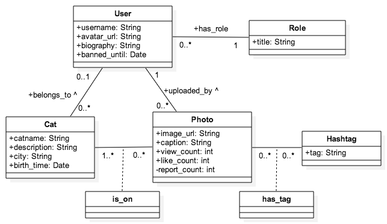
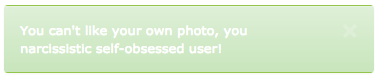
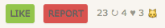
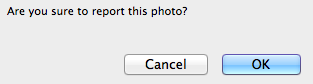
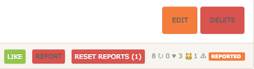
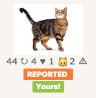
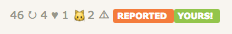

# Catstagram - Final Report
Simple Cat version of Instagram in Ruby on Rails - for Webrails class at HEIG-VD.

**This is the final report. If you're not into reading documentation and prefer to test yourself, go directly to
[Installation Indications](#installation-indications)**

## Table of Contents

- [Introduction](#introduction)
- [Specifications](#specifications)
	- [General Description](#general-description)
	- [Usecases](#usecases)
	- [Database schema](#database-schema)
	- [Permissions and Rights](#permissions-and-rights)
- [Software Structure](#software-structure)
- [Technical considerations](#technical-considerations)
	- [AJAX in practice](#ajax-in-practice)
	- [Librairies used](#librairies-used)
	- [Like, Report & Reset Report of PHOTOS](#like-report--reset-report-of-photos)
	- [Banning Users](#banning-users)
	- [Layouts and partial views](#layouts-and-partial-views)
- [Project Management](#project-management)
- [Project State](#project-state)
	- [Initial Iterations plan](#initial-iterations-plan)
	- [Actual Management](#actual-management)
- [Conclusion](#conclusion)
- [Annexes](#annexes)
	- [Installation Indications](#installation-indications)
	- [Usage Manual](#usage-manual)

## Introduction

This is a Ruby on Rails project for WebRails class at [HEIG-VD, Yverdon-les-Bains](http://heig-vd.ch/international), Switzerland, done by [Eleonore d'Agostino](http://github.com/paranoodle) and [Valentin Minder](http://github.com/ValentinMinder) in Spring 2016.

This report will go through the planned specifications and management and check against the final project to check for consistency and project success. At the end you'll find a documentation how to install and use the website.

## Specifications 
###### (*Cahier des charges)*

### General Description
###### *Type site, Objectives*

Catstagram is a simple version of Instagram for photos of cats only. It allows registered users to upload photos of cats, tag them and share them with all their friends, because sharing is caring ;3 

The more you share, the more views you get! :D

Guests can see photos of specific cats or uploaded by specific users! And cats by categories, of course!

Be cautious, if you upload anything other than a cat photo and you get reported too many times, the admins might ban you!

### Usecases
###### (*Cas d'utilisation*)

See the following image:


A guest is a non-registered or non-logged visitor of the website. They are limited to VIEW capacities on everything, and have no right to EDIT. A guest may:

- view user and cat profile details
- search and view photos by hashtag, user or cat
- view photos (direct link to single photo), increasing the view count of the photo
- create an account with *sign-up*, or login with *sign-in*

A user is a registered and logged visitor of the website who doesn't have admin rights. A user has VIEW capabilites on everything, and EDIT capabilites on their own data. A user may:

- do everything a guest can
- edit their own user profile
- upload or edit photos on their own account. Uploading a photo includes optionally tagging cats and categories (hashtags). This includes creating new hashtags (categories), when those available do not suffice. Of course, they can upload photos of cats that don't belong to them.
- create or update cat profiles (of their own cats only)
- report bad photos, like those with dogs, increasing the report count of the photo
- like photos, increasing the like count of the photo

An admin is a registered and logged visitor of the website that has admin rights. An admin has the right to VIEW and EDIT on everything. An admin may:

- do everything a user can
- view the report count of a photo, receive some kind of alerts of new reports, and reset report counts
- decide what to do with reported photos, including:
	- remove reported photos
	- ban related user
	- remove related user (with all its photos)
- edit everything (CRUD actions), including the edition of any field/relation that doesn't have a special meaning (see "About Rights" section). It may also include ban users, when they were reported for bad behaviors (eg per email).

Note that views, likes and reports counts are not related to users. View counts reflects the number of times a photo was opened in a browser, even if it was done 10x by the same person. The same goes with like and reports, but those are only available for logged users. This system is open to abuse but it allows for a simpler system, otherwise it would require a lot more relations and be more complex. 

### Database schema

TODO: conceptul AND relationnal schema!

See the following image:



A user is a registered human visitor that may have some role (and admin rights). Fields generated by Devise for account creation and authentication are not shown (such as login/password), as well as fields handled by Ruby by default (such as created_at). Users own cats and upload photos (therefore cats belongs to their user owner, and photos are uploaded by users).

Cats are tagged on photos, and at least one cat must be tagged on every photo. If the cat is unknown, a special entity called the "Chanonyme" (Catnonymous) is tagged instead. If the cat becomes known, the owner of the photo or the admin may change the tag.

Cats may not have an owner. In that case, they are only editable by admins, and admin may assign them an owner. Such "non-owned cat" may be merged into an owned cat by the admin (the non-owned cat profile is destroyed and all its tag on photos are forwarded to the owned cat).

Hashtags are similar to categories, where any photo may belong to any number of hashtags (from 0 to N).

### Permissions and Rights

The following fields are set once and forever, and cannot be edited, even by an admin:

- id
- created_at
- updated_at

All the counts fields cannot be edited, even by an admin. They are set to 0 by default and incremented automatically when the related actions are performed. However, admins may reset the report count to 0 when handling reports. 

Admins may set the banned_until field to ban a user (otherwise this field is left blank). Users cannot connect until the end of the ban period.

In all entities, there is at least one field that is mandatory. All the others are optional (or they have special meaning, explained before)

- username
- title
- catname
- image_url
- tag

Users may add/edit/remove all **other** data:

- in their profile (username, avatar_url, biography)
- in their cats' profile (catname, city, description, birth_time)
- in a photo they uploaded (caption, cats tagged, hashtags tagged). They cannot change the image URL though. If a user wishes to change photos, they have to delete the current one and upload a new one, as likes/hashtags/cats tagged may not be relevant to the new photo.

Users may remove a photo they uploaded, a profile of a cat they own, or even their whole profile (deleting a user will delete all uploaded photos, but cats will remain, without an owner).

As the admin has CRUD rights on everything, they can do everything a user can on all users' data. Moreover, they have special CRUD rights (in that sense, edit means all CRUD actions)

- They can set the `banned_until` field and reset the `report_count` field
- A cat without an owner is only editable by an admin
- They may assign cats to an owner, or remove ownership
- They may assign roles
- They may edit hashtags

## Software structure 
###### (*Structure du logiciel*)

We use Rails' standard MVC structure, with Models in `app/models`, Views as webpages in `app/views` and Controllers in `app/controllers`.

### Guest actions:

- View the main page - `photos_controller#index_main`
- View all users - `users_controller#index`
- View user profiles - `users_controller#show`
- View all cats - `cats_controller#index`
- View cat profiles - `cats_controller#show`
- View all hashtags - `hashtags_controller#index`
- View all photos - `photos_controller#index`
- View photos by hashtag -  `hashtags_controller#show`
- View photos by user - `users_controller#show`
- View photos by cat - `cats_controller#show`
- View photo via direct link (increments view count) ` photos_controller#show`
- Search photos - `photos_controller#search`
- Create an account and update an account (*sign up*) - default `Devise::RegistrationsController` and `registrations_controller` (for custom values of forms)
- Log in to/log out from an existing account (*sign in*) - default `Devise::SessionController`
- `users_controller#new` and `users_controller#create` are removed, because there are handled by devise sign-up.
- Get a 403 Unauthorized Error when accessing a forbidden page `application_controller.rb` for `rescue_from CanCan::AccessDenied`

### User Actions

- Edit their own profile - `users_controller#edit`
- Upload photos - `photos_controller#new`
- Edit their own photos - `photos_controller#edit`
- Delete their own photos - `photos_controller#destroy`
- Create a new cat profile - `cats_controller#new`
- Edit their own cat profiles - `cats_controller#edit`
- Delete their own cat profiles - `cats_controller#destroy`
- Delete their own profile - `users_controller#destroy`
- Report bad photos - `photos_controller#report`
- View the report count of a photo - `photos_controller#show`
- Like photos - `photos_controller#like`

### Admin Actions

- Receive alerts of new reports - no controllers involved, just an alert & number in the navigation bar
- View new reports - `photos_controller#reported`
- Reset report counts - `photos_controller#reset`
- Remove reported photos - `photos_controller#destroy`
- Ban (and unban) user - `users_controller#ban` and `users_controller#ban_update`
- View banned users - `users_controller#banned`
- Remove user - `users_controller#destroy`
- Create empty new hashtag - `hashtags_controller#new`
- View editable list of all hashtags - `hashtags_controller#index_admin`
- Edit everything - `[NAME]s_controller#edit` and `users_controller#edit_roles` and `users_controller#save_roles`
- Destroy everything - `[NAME]s_controller#destroy`

## Technical considerations 
###### (*Implémentation*)

### AJAX in practice

While our original plan was to allow optional tag auto-completion during photo upload, this proved to be beyond our skills even after extensive reading on the subject. It was already hard enough implementing dynamic text fields (pressing the "Add Tag" button adds a new text field whose content *will* be correctly saved), but we couldn't find how to work an optional drop-down in without using a `collection_select`, which... we can't type in.

So we went with our second idea.

The final AJAX we use allows us to *like* photos without reloading the page, and updates the like count on the photo accordingly, after which the *like* button disappears.

This is done via three files:

- In `app/views/photos/show.html.erb`, we set up the like button `link_to` with the option `remote: true`, along with a specific id so we can refer back to it. We also give an id to a span containing the `@photo.like_count` value.
- In `app/controllers/photos_controller.rb`, in the `like` function, we render the `update_likes.js` file after we finish the checks and modifications we wanted.
- In `app/views/photos/update_likes.js`, we have simple jQuery commands to hide the like button via its id, and replace the old `like_count` in the span with the new `like_count` value we computed in the controller.

### Librairies used

The only major library we used was ImageMagick, for the purpose of automatically resizing images to create thumbnails. While we could have just used HTML tags to keep only one copy of each image and display, this requires downloading all the images at full size and slows down the page loading considerably, especially for users with poor connections.

As is, when an image is uploaded, we automatically save a resized copy of it for use as thumbnails. This is done in the `app/uploaders/image_uploader.rb` file:

```
version :thumb do
  process :resize_to_fit => [100, 100]
end
 ```
 
This saves a thumbnail of the image. If our image URL is accessible at `photo.image_url`, the thumbnail URL is accessible at `photo.image_url.thumb.url`.

### Like, Report & Reset Report of PHOTOS

#### Rights management

- Users recieve the `:like_photo` and `:report_photo` rights, onlly on photos that are not theirs. 
- Admin recieve the `:reset_report_photo` rights, only on photos that are not theirs.
- These rights are sufficient for the views to display the correct buttons with `if can? :like_photo, @photo`.
- These rights have to be handled carefully on the **photo controller**, because we want the following behavior: all these `<actions>` are not allowed on own photo but allowed on others (which non-admin user don't manage)
	- first, `skip_authorize_resource :only => [:like, :report, :reset]` to allow non-managing users to edit the photos
	- then, at the beginning of each `<action>` method (like, report, reset): `authorize! :<action>_photo, @photo` to allow only users with these rights. However, managing users (typically owner) will still have the right, and we don't want a user to like his own photo.
	- moreover, it's necessary to discard the request `if current_user == @photo.user` as the owner user cannot perform these actions (but was not discarded by authorization as it is managing the photo!)

A user might still try to like his own picture by entering the direct link `/photos/1/like`. It won't be catched by authorization failure and won't create a 400 error, but will enter in the if branch we just defined and produce the following message.



#### Buttons (on show view)

On the show view of a photo, two buttons allow a user to like or report the photo. 



The report asks for confirmation.



As soon as a photo is reported, the admin view changes: there is an additionnal button ***"New Reports! (X)"*** in the navigation bar, where `X` is the number of reported photos, that redirect to  `/photos/reported`. It displays the same interface as the photos index, but only photos with a `report_count` greater than 0 and ordered by this count, and then by date.

If the photo is reported, an admin has a another option, to reset the `report_count`. It also asks for confirmation. Of course, it may also edit or delete the picture itself, or even go to the user's profile and delete or ban him, as an admin has managing rights.



#### Visibility (on index and show views)
The view count is incremented each time anyone loads the page (use refresh to force a new view).

On the index and show views, next to each photo are visible, for every visitor, the number of views (#V), likes (#L) and cats (#C), in the following form:

 #V&#8635; #L&#9829; #C&#128049; 
 
If the user can report the photo and the photo is reported (has a `report_count` #R greater than 0), then it will be:

 #V&#8635; #L&#9829; #C&#128049; #R&#9888; 

Moreover, if the user can manage the photo (it's a connected user owner of the photo or with admin rights), it will see an orange banner "REPORTED". It will be clearly visible that he should take action (edit or delete the photo). 

On the index of photos, it will look like this:



And on the show view of a specific photo, like this (in the footer):



### Banning users

TODO.

### Layouts and partial views

All index views use the same layout (boxes of items) in a partial view `_grid`, with two parameters `@title` and `@collection`, where `collection` may be `photos`, `cats`, `users` or `hashtags`. 

- This allows the usage of the same layout in the home screen (recent photos), the photos listing, the photos of a cat, the photos uploaded by a user and the result of photos.
- It also allows the presence of several partial views on the same page, as on the home screen (the most recent of all collection) or the search results.

## Project Management 
###### (*Gestion de projet*)

### Initial Iterations plan

#### Week 8-9 (18.04. - 01.05.2016)

- basic structure of whole project (scaffold, db, basic usable layout...)
- no permissions: basic CRUD operations on everything

#### Week 10-11 (02.05. - 15.05.2016)

- account creation and authentification (with Devise)
- permissions (guest, user, admin) (with CanCanCan)
- basic upload form, with tagging cats and hashtags

#### Week 12-13-14 (16.05. - 05.06.2016)

- AJAX: autocompletion of hashtags in upload form
- AJAX: update of views/likes count asynchronous (by the user who viewed/liked the photos)
- pretty upload form
- clean and pretty layout (UI)
- report and presentations preparations

#### Week 15-16 (06.06 - 19.06.2016)

Oral presentations

### Actual Management

Some elements were shifted around a little across iterations. Per example, we had planned to implement a "simple" like with a GET on `photos/:id/like`, that would reload the page, during the first iteration, but we decided to do it directly with AJAX in the third iteration.

Globally, this project was very well managed, all iterations are fully finished, and the team completed the work successfully and quite well balanced.

## Project state 
###### (*Etat des lieux*)

In general, the project is completed and follows the initial plan, and all main features have been implemented, including the banning and reporting features that were important for such a website. 

Some details were not implemented, but they don't affect in any way the normal website workflow.

Not implemented: 

- auto-completion of hashtags in upload form  (see AJAX section)
- "merging" multiple ownerless cats, or an ownerless cat into an owned cat (removing duplicates)
- keeping track of creator of cats, especially for ownerless cast: once a cat is created ownerless, only the admin can take care of him. It's the same if someone abandons his own cat.
- catnonymous is not automatically tagged if no other cat is tagged (but it is still possible to tag him manually)

Known bugs / glitches:

- the upload form requires a refresh before working properly with the multiple tags. This is due to the javascript not being loaded, but we have not been able to discern why.


## Conclusion

Globally this project was a success and we learned a lot of things. 

However, 

## Annexes

### Installation Indications

#### Prerequesites

You need on your system

- `ruby` (tested with 2.2.3p173)
- `rails` (tested with 4.2.5.1)
- `mysql`
- `imagemagick`. It comes by default on most linux distribution, otherwise use your favorite packet manager ton get it, like un Linux `sudo apt-get install imagemagick` or on MacOS X `brew install imagemagick`

#### Configuration

It is necessary to set up `mysql` with a database `catstagram` first, and to check database connection settings in `config/database.yml`. Follow theses steps

- Create a table named `Catstagram` in your mysql editor.
- Run mysql
- Move to the project directory: `cd Catstagram`
- Update the database config (host, user, password) of the file `Catstagram/config/database.yml` using your favorite editor (`nano`, `vim`, etc)
- Run the following command to install & update bundles: `bundle install; bundle update`
- Import the latest migrations: `rake db:migrate`
- Run the server: `rails s`

#### Launch

When you're done with database configuation, the project is production-ready, just type:

```
rails s
```

The server is now running and reachable at `server:port`, namely [localhost:3000](localhost:3000) if you run it on your own machine with default settings.

#### Fixtures

The project is furnished with fixtures that will populate the database with a few examples, create the necessary roles to see the website in action, and set up an admin account. To load the fixtures type:

```
rake db:fixtures:load
```


You may login as an admin with the following account:

```
email: admin@cat.com
login: admin1
```

The other accounts are simple users, all with `login:user12`:

```
paranoodle@cat.com (regular user)
val@cat.com (regular user)
bad@cat.com (banned users)
dev@cat.com (tester)
```

### Usage Manual 
###### (*Mode d'emploi)*

#### As Guest


#### As User


#### As Admin

TODO. (with printscreens)
